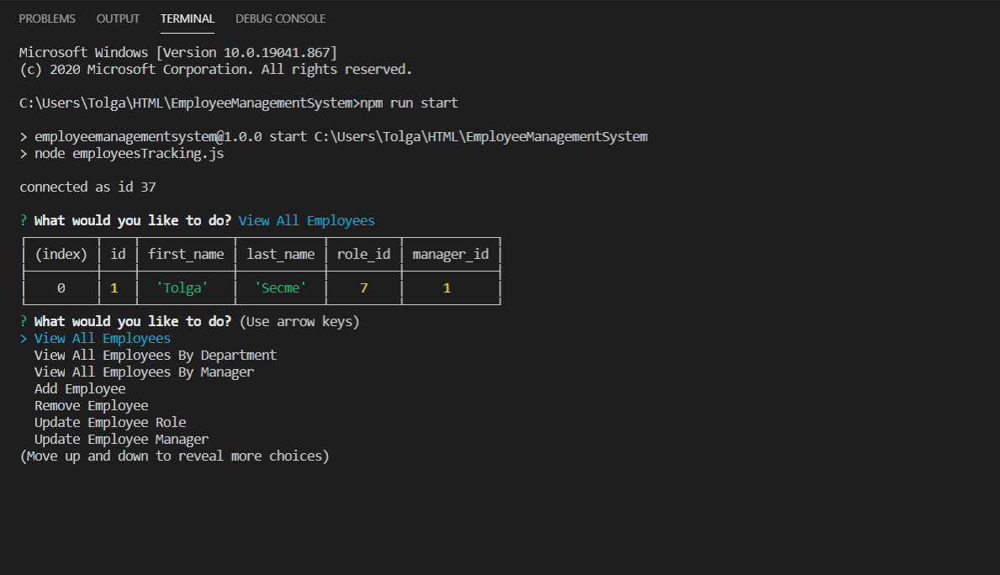

# EmployeeManagementSystem

## Contents

1. [Technologies-Used](#Technologies-Used)
2. [Description](#Description)
3. [Installation](#Installation)
4. [Usage](#Usage)
5. [Credits](#Credits)
6. [Contributing](#Contributing)
7. [Questions](#Questions)
8. [Video](#Video)

## Technologies-Used

1. Javascript
2. Node.js
3. Node packages
   - Inquirer
   - MySQL
4. MySQL Database

## Description

- Employee management system, it helps you to get information about people who works at the company, which department, what roles, or their salary..

## Installation

- You will need to have node packages (inquirer/mySQL), after you all set the packages, you can run the application with the terminal.

## Usage

- User needs to run this application with the terminal, and answer the following questions, you will be able to check employees, departments, add employee, remove employee and so on.

## Credits

- Instructions given by Trilogy Education Services, assignment created and done by Tolga SECME.

## Contributing

- No contributes.

##  Questions

- E-mail me for any questions [tolgasecme@icloud.com](mailto:tolgasecme@icloud.com)
- Also you can find me on Github [TolgaS92](https://github.com/TolgaS92).

## Video

1. [Employee Management System](-------------)
